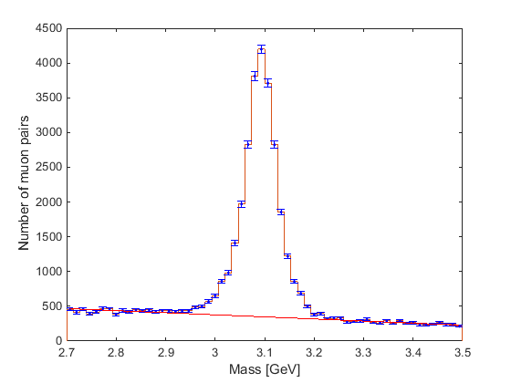

[](https://mybinder.org/v2/gh/bethel-physics/ParticleDiscoveryLab/HEAD)

# Particle Discovery lab (for students!)

The particle discovery lab uses [CMS dimuon data from 2016](http://doi.org/10.7483/OPENDATA.CMS.UZD7.Z50M) published via the [CERN Open Data Portal](http://opendata.cern.ch/). 
We have developed an undergraduate intermediate-level lab exercise to complement the many high school-level exercises available via the Open Data Portal.
Student code is available in both MATLAB and Python, and does not require special CMS Open Data software. Instructions for using either software option are in separate sections below.

The goal of this exercise is for you to reconstruct decays of unknown particle X (initial state) to 2 muons (final state). You will use histograms to display their calculated mass for particle X, and learn about fitting and subtracting background contributions from data. Uncertainty propagation concepts are included through each step of the analysis. After isolating the signal distribution you will determine which particle they have discovered and compare their observed properties (mass and width) to the known properties. 



## Visualize the data
As an introduction to this exerience, there are event displays available from the "DoubleMuParked" 2012 dataset that is conceptially identical to the dataset we are studying. The [ISpy Event Display](http://opendata.cern.ch/visualise/events/cms#) is a web-based tool to study events interactively, so you can explore this quickly on your laptops. To get
to our dataset:
 * Click on the "folder" icon in the upper left corner
 * Select "Open files from the web"
 * Single-click on "Run2012B/"
 * Scroll down and single-click on "DoubleMuParked_0.ig"
 * Click on any of the individual events that appear in the right-hand column
 * Click "Load"
Click and drag to rotate the image around! The yellow cylinder represents a detector element for scale, and the red boxes show which muon detector elements were hit by the 2 muons in each event. More detector or physics elements can be showed by making selections in the left-hand menu.


## MATLAB (MatlabAnalysis folder)
**Software setup**: [MATLAB](https://www.mathworks.com/products/matlab.html) should be installed on whatever computers you will use for the exercise. The "statistics and machine learning toolbox" is the only package used beyond the basic MATLAB install. This package might be part of your MATLAB license. Write to Julie Hogan for options to use the "curve-fitting toolbox" instead. This exercise is written using MATLAB "live scripts", which can display text and instructions with typical web formatting and provide smaller code boxes for you to use.

**Exercise materials**:

 * Download this Github code!
 * Find your files: (`MuonAnalysis_student.mlx`) and the workspace (`DoubleMuon_2016H_200k.mat`).
 * Download the `pollsf.m` function file from Alejandro Garcia's [*Numerical Methods for Physics*](https://github.com/AlejGarcia/NM4P/tree/master/MatlabRevised) repository.

### Understanding the workspace
The workspace stored in `DoubleMuon_2016H_200k.mat` contains the energy and 3-momentum for "muon 1" and "muon 2". When you load the workspace you'll see 4 variables: 
arrays of size (2 x nEvents) for `E`, `px`, `py`, and `pz`. The default unit for these numerical values is the GeV.

Values for "muon 1" are stored in the first index, and values for "muon 2" are stored in the second index. Energies can be accessed like this:
```
i = 294;   # Let's look at event number 294
E_muon1 = E(i,1);  # MATLAB counts indices from 1, not 0!
E_muon2 = E(i,2);
```

### To start from the 200k event workspace
You can start by opening `MuonAnalysis_student.mlx` with MATLAB. This contains the instruction of how to set your file path and load the workspace. When you run the first section you will be prompted to enter a mass range. Try one of these:
 * 2.8 GeV -- 3.5 GeV
 * 8 -- 12 GeV
 * 60 -- 120 GeV 


## Python (PythonAnalysis folder)

**Software setup**: Python 3 should be installed on whatever computer you will use for the exercise. There are many methods to access Python:
 * If your computational courses use Python via a certain program, such as Anaconda, that will almost certainly be the simplest thing to use.
 * Binder: You can run these Jupyter notebooks on the web! https://mybinder.org/v2/gh/bethel-physics/ParticleDiscoveryLab/HEAD
 * The [CMS Open Data Python docker container](https://opendata.cern.ch/docs/cms-guide-docker) can be installed on lab or individual computers and used for the exercises.
 * Contact Julie Hogan to brainstorm python solutions if needed. 

The following python packages are needed for the exercise:
 * [matplotlib](https://matplotlib.org/)
 * [pickle](https://docs.python.org/3/library/pickle.html)
 * [numpy](https://numpy.org/)
 * [scipy](https://www.scipy.org/)
 * [jupyter](https://jupyter.org/) -- optional, if using the notebooks.
 * Use `pip install <packagename>` to install any of these packages

**Exercise Materials**:

 * Download this Github code!
 * Find your files: `MuonAnalysis_student.py` (or the corresponding `.ipynb`), the pickle file (`DoubleMuon_2016H_200k.pkl`), and `pollsf.py`. The `pollsf.py` function file is adapted directly from Alejandro Garcia's [*Numerical Methods for Physics*](https://github.com/AlejGarcia/NM4P/tree/master/MatlabRevised) repository.

### Understanding the workspace
The data is stored in `DoubleMuon_2016H_200k.pkl` as a "list of lists". Each item in the list contains 8 numerical values in this order: `E1`, `E2`, `px1`, `px2`, `py1`, `py2`, `pz1`, `pz2` (where "1" refers to "muon 1" and "2" refers to "muon 2") The default unit for these numerical values is the GeV.

Energies for each muon can be accessed like this:
```
data = pickle.load(open('DoubleMuon_2016H_200k.pkl','rb'))
i = 294;   # Let's look at event number 294
E_muon1 = data[i][0];  # Python counts indices from 0, different from MATLAB
E_muon2 = data[i][1];
```

### To start from the 200k event workspace
If you will use the standard python script, start by opening `MuonAnalysis_student.py`, which is already set to import packages and load the pickle file:
```
$ cd /path/to/files/they/downloaded/
$ vi MuonAnalysis_student.py  # or their favorite text editor
```

To use jupyter instead, launch a notebook, wait for the web browser to launch (or paste the link), and then click on the MuonAnalysis_student.ipynb file. The instructions to launch a jupyter notebook vary based on the python platform used -- an example is provided here, but adaptation might be necessary. 
```
$ cd /path/to/files/they/downloaded/
$ jupyter notebook  # in the Open Data docker container use: jupyter-lab --ip=0.0.0.0 --no-browser
[I 10:53:47.697 NotebookApp] Serving notebooks from local directory: /home/...somepath.../ParticleDiscoveryLab
[I 10:53:47.697 NotebookApp] 0 active kernels 
[I 10:53:47.697 NotebookApp] The Jupyter Notebook is running at: http://localhost:8888/?token=lonnnnnggggstringofrandomletters
[I 10:53:47.697 NotebookApp] Use Control-C to stop this server and shut down all kernels (twice to skip confirmation).
[C 10:53:47.697 NotebookApp] 
    
    Copy/paste this URL into your browser when you connect for the first time,
    to login with a token:
        http://localhost:8888/?token=lonnnggggggstringofrandomletters
```

When you run the you will be prompted to enter a mass range. Try one of these:
 * 2.8 GeV -- 3.5 GeV
 * 8 -- 12 GeV
 * 60 -- 120 GeV 
 
### Getting help

Reach out to Julie Hogan for help! You can add an "issue" to this Github repository, or contact me by email.